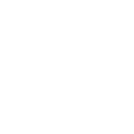

**[Home](https://omarzohdi.github.io/) >> Open Source**

## Open Source Contributions

  <h3>O3DE - BuonGIorno Sample</h3>
  
  
Buon(G.I.)orno a stylized representation of a small italian village meant to showcase what it's possible to achieve thanks to Ray-Traced Global Illumination in a mobile-friendly game environment.

  <a href="https://github.com/o3de/buongiorno-sample"></a>

  <h3>PowerVR Graphics SDK</h3>
  
  
The PowerVR SDK is an open source codebase to help with the development of graphics applications for PowerVR and other platforms. 

  <a href="https://github.com/powervr-graphics/Native_SDK"></a>

