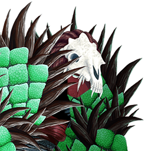
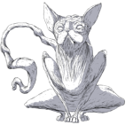

**[Home](https://omarzohdi.github.io/) >> Projects**

## Projects

  <h3>Blood Myth</h3>
  
  
Mobile game, developed in Unity, aimed at creating empathy for people with sickle cell disease by encouraging adherence to crisis-prevention methods, self-care, and promotion of a life-affirming, hopeful perspective."

  <a href="http://playforchange.cdm.depaul.edu/projects/soteria/"></a>

  <h3>Soteria: Dreams as Currency</h3>
  
  
A single-player, 3D adventure game, Developed in Unity, designed to promote players’ readiness to use psycho-therapeutically proven strategies to overcome general anxiety disorder.

  <a href="http://playforchange.cdm.depaul.edu/projects/soteria/"></a>

  <h3>Perfection</h3>
  
  
A web game about the eating disorder anorexia nervosa, a phenomenon that is often highly misunderstood by people without first hand experience and freight with misconceptions.

  <a href="https://github.com/omarzohdi/Perfection"></a>

